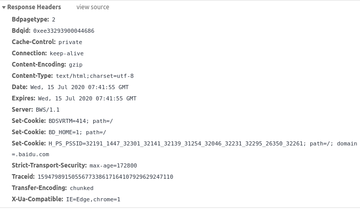

#HTTP 基本原理

## URI和URL

URI的全称为Uniform Resource Identifier 统一资源标志符
URL的全称为Universal Resource Locator 统一资源定位符

举例来说 https://github.com/favicom.ico是github的网站图标链接。
它是一个URL，也是一个URL。

URL是URI的子集，也就是每个URL都是URI，但不是每个URI都是URL。
URI还包括子类叫做URN - Universal Resource Name 统一资源名称。
URN只命名资源而不指定如何定位资源，比如urn:isbn:0451450523指定了一本书的ISBN，
可以唯一标识这本书，但是没有指定到哪里定位这本书。这就是URN

目前互联网中，URN用的非常少，所以几乎所有的URI都是URL。
一般的网页链接我们既可以称为URL，也可以称为URI。

## 超文本 hypertext

网页的源代码HTML就可以称为超文本。

## HTTP和HTTPS

URL开头会有http或https这是访问资源需要的协议类型。

HTTP Hyper Text Transfer Protocol 超文本传输协议。
用于从网络传输超文本数据到本地浏览器。

HTTPS Hyper Text Transfer Protocol over Secure Socket Layer
简单讲就是HTTP的安全版，即HTTP下加入SSL层，简称为HTTPS。

HTTPS的安全基础是SSL，因此通过它传输的内容都是经过SSL加密的，主要作用可以分为两种。
- 建立一个信息安全通道来保证数据传输的安全。
- 确认网站的真实性，凡是使用了HTTPS的网站，
都可以通过点击浏览器地址栏的锁头标志来查看网站认证之后的真是信息，
也可以通过CA机构颁发的安全签章来查询。

## HTTP请求过程

我们在浏览器中输入一个URL，回车之后便会在浏览器中观察到页面内容。
实际上，这个过程是浏览器向网站所在的服务器发送了一个请求，
网站服务器接受到这个请求后进行处理和解析，然后返回对应的响应，接着传回给浏览器。
响应里包含了页面的源代码等内容，浏览器再对其进行解析，然后网页便呈现出来了。

为了更直观地说明这个过程，这里用Chrome浏览器的开发者模式下的Network监听组件做下测试，
它可以显示访问当前请求网页时发生的所有网络请求和响应。

输入www.baidu.com
在network页面下方出现了一个个条目，其中一个条目就代表一次发送请求和接受响应的过程。

我们先观察第一个网络请求，即www.baidu.com
其中各列含义如下：
- 第一列Name: 请求的名称，一般会将URL的最后一部分内容当作名称。
- 第二列Status: 相应的状态码，这里显示为200,代表相应是正常的。
通过状态码，我们可以判断发送了请求之后是否的到了正常的响应。
- 第三列Type: 请求的文档类型。
这里为document,代表我们这次请求的是一个HTML文档，内容就是一些HTML代码。
- 第四列Initiator: 请求源。用来标记请求是由哪个对象或进程发起的。
- 第五列Size:从服务器下载的文件和i请求的资源大小。如果从缓存中取得的资源，则该列会显示from cache。
- 第六列Time: 发起请求到获取相应所用的总时间。
- 第七列Waterfall: 网络请求的可视化瀑布流。

点击条目会得到更详细的信息。

首先是Gereral部分，
- Request URL: 请求的URL
- Request Method: 请求的方法
- Status Code: 相应状态码
- Remote Address:远程服务器的地址和端口
- Referrer Policy： Reffer判别政策

再继续往下，可以看到Response Headers和Request Headers。
分别代表相应头和请求头。

请求头里我们可以看到许多请求信息：
- 浏览器标识
- Cookies
- Host

这是请求的一部分，服务器会更具请求头内的信息判断请求是否合法，进而作出对应的相应。

上图中就包含了服务器的类型、文档类型、日期等信息。
浏览器接受到相应后，会解析相应内容，进而呈现网页内容。

## 请求

### 请求方法 Request Method

常见的请求方法有两种： GET和POST

GET和POST请求方法有如下区别：
- GET请求中的参数包含在URL里面，数据可以在URL中看到，而POST请求的URL不会包含这些数据，
数据都是通过表单形式传输的，会包含在请求体中。
- Get请求提交的数据最多只有1024字节，而POST方式没有限制。

其他请求方法

- GET 请求页面，并返回页面内容
- HEAD 类似于GET请求，只不过返回的响应中没有具体的内容，用于获取报头
- POST 大多用于提交表单或上传文件，数据包含在请求体中
- PUT 从客户端想服务器传送的数据取代指定文档中的内容
- DELETE 请求删除指定的页面
- CONNECT 把服务器当作跳板，让服务器代替客户端访问其他网页
- OPTIONS 允许客户端查看服务器的性能
- TRACE 回显服务器收到的请求，主要用于测试或诊断

### 请求的网址 Request URL

请求的网址，即统一资源定位符URL，它可以唯一确定我们想请求的资源。

### 请求头 Request Headers

用来说明服务器要使用的附加信息。

- Accpet: 请求报头域，用于指定客户端可接受哪些类型的信息
- Accept-Language: 指定客户端可接受的语言类型
- Accept-Encoding: z指定客户端可接受的内容编码
- Host: 用于制定请求资源的主机IP和端口号，其内容为请求URL的原始服务器或网关的位置。
从HTTP1.1版本开始，请求必须包含此内容。
- Cookie: 也常用负数形式Cookies，这是网站为了辨别用户进行会话跟踪而存储在用户本地的数据。
它的主要功能是维持当前访问会话。
- Refer: 此内容用来标识这个请求是从那个页面发过来的，服务器这里拿到这个信息并作相应的处理，
如来源统计、防盗链处理等。
- User-Agent: 简称UA，它是一个特殊的字符串头，可以使服务器识别客户使用的操作系统及版本、
浏览器及版本信息等信息。**在做爬虫时加上此信息，可以伪装成浏览器，如果不加，
很可能会被识别出为爬虫。**
- Content-Type: 也叫互联网媒体类型(Internet Media Type)或者MIME类型，
在HTTP协议消息头中，它用来表示具体请求中的媒体类型信息.参考网址：https://tool.oschina.net/commons

**请求头是请求的重要组成部分，再写爬虫时，大部分情况下都需要设定请求头。**

### 请求体 Request Body

一般承载的内容是POST请求中的表单数据，而对于GET请求，请求体则为空。

**在爬虫中，如果要构造POST请求，需要使用正确的Content-Type, 
并了解各种请求库的各个参数设置时使用的是哪种Content-TYPE,
不然可能会导致POST提交后无法正常运行**

## 响应

### 相应状态码 Response Status Code

参考网址：https://tool.oschina.net/commons?type=5

### 响应头 Response Headers

包含了服务器对请求的应答信息：
- Date: 标识响应产生的时间
- Last-Modified: 指定资源的最后修改时间
- Content-Encoding: 指定响应内容的编码
- Server: 包含服务器的信息 ,比如名称、版本号等
- Content-Type: 文档类型 ,指定返回的数据类型是什么。
- Set-Cookie: 设置 Cookies。 响应头中的Set-Cookie告诉浏览器需要将此内容放在Cookies
中, 下次请求携带Cookies请求 。
- Expires: 指定响应的过期时间, 可以使代理服务器或浏览器将加载的内容更新到缓存巾。如
果再次访问时,就可以直接从缓存中加载, 降低服务器负载,缩短加载时间 。

### 响应体 Response Body

最重要的当属响应体的内容了。 响应的正文数据都在响应体中,比如请求网页时,它的响应体就
是网页的HTML代码; 请求一张图片时 , 它的响应体就是图片的二进制数据。我们做爬虫请求网页后,
要解析的内容就是响应体。

***在做爬虫事，我们主要通过响应体得到网页的源代码、Json数据等，然后从中做相应内容的提取***。

