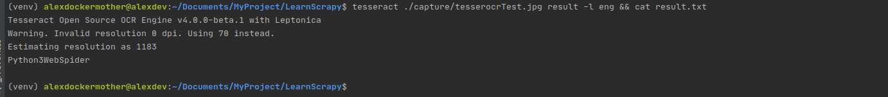

# 2020-7-13 笔记
爬虫可以简单分为几步：
- 抓取网页
- 分析页面
- 存储数据

## 请求库的安装

在抓取网页的过程中，我们需要模拟浏览器向服务器发出请求，所哟要用到一些Python库来实现HTTP请求。
- requests
- Selenium 
    >是一个自动化测试工具，利用它我们可以驱动浏览器执行特定的动作,如点击、下拉等操作。
    对于一些JavaScript渲染的页面来说，这种抓取方式非常有效。
- aiohttp
    > 异步web服务的库

### Chrome driver


http://chromedriver.chromium.org/downloads


如果弹出一个空白的chrome浏览器，则证明所有的配置没有问题。
如果弹出后山退，可能ChromeDriver版本与Chrome版本不兼容。

### Firefox

对于Firefox可以安装GeckoDriver,安装方法与安装Chrome driver相似

http://npm.taobao.org/mirrors/geckodriver/

### PhantomJS

PhantomJS是一个无界面的、可脚本编程的Webkit浏览器引擎，
它原生支持多种Web标准：DOM操作、CSS选择器、JSON、Canvas以及SVG

## 解析库的安装

- lxml支持HTML和XML的解析，支持XPath解析方式，而且解析效率非常高。
- Beautiful Soup是Python的一个HTML或XML解析库，依赖于lxml
```python
from bs4 import BeautifulSoup
soup = BeautifulSoup("<p>Hello</p>", 'lxml')
print(soup.p.string)
```
运行结果
>Hello

## pyquery

也是一个强大的网页解析工具，提供了和jQuery类似的语法来解析HTML文档，支持CSS选择器

## tesserocr

在爬虫过程中，难免会遇到各种各样的验证码，而大多数验证码还是图形验证码，
这时候我们可以直接使用OCR来识别。

### OCR

Optical Character Recognition 光学字符识别，是指通过扫描字符，然后通过其形状将其翻译成电子文本的过程。

tesserocr是Python的一个OCR识别库是对tesseract的PythonAPI封装，所以核心是tesseract。
因此要先安装tesseract。

#### Ubuntu下安装

>sudo apt-get install -y tesseract-ocr libtesseract-dev libleptonica-dev

默认支持吃如下语言


扩展语言包

> git clone https://github.com/tesseract-ocr/tessdata.git

> sudo mv -f tessdata/* /usr/share/tesseract-ocr/4.00/tessdata/

> tesseract ./capture/tesserocrTest.jpg result -l eng && cat result.txt



```python
import tesserocr
from PIL import Image
image = Image.open('../capture/tesserocrTest.jpg')
print(tesserocr.image_to_text(image))

print(tesserocr.file_to_text('../capture/tesserocrTest.jpg'))
```

