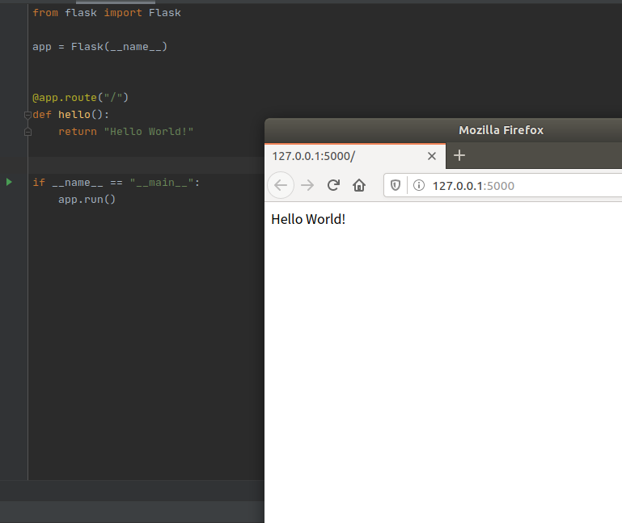
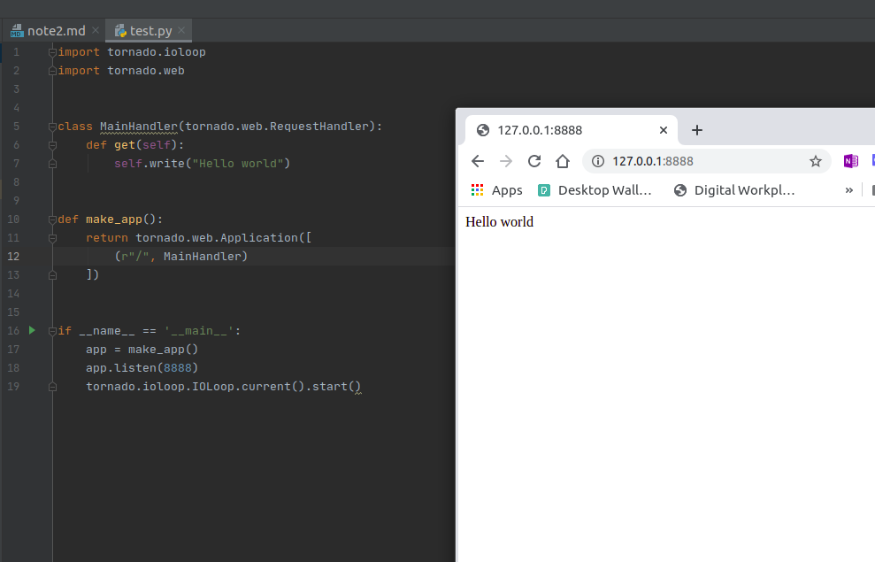

# 2020-7-14 笔记

## MySQL安装
## MongoDB 安装
## Redis 安装
>sudo apt-get -y install redis-server

##PyMySQL
##PyMongo
##redis-py

##RedisDump
这是一个用于redis数据导入/导出的工具，是基于Ruby实现的，

> sudo apt-get install ruby ruby-dev gcc

> gem install redis-dump

## Web库

### Flask

利用flask + redis 维护动态代理池

### Tornado

是一个支持异步的web框架，non-blocking io

利用Tornado + Redis搭建一个ADSL拨号代理池

## 爬虫类框架

### puspider

> sudo apt-get install python-dev python-distribute libcurl4-openssl-dev libxml2-dev libxslt1-dev python-lxml
> apt-get install libssl-dev

### scrapy

#### Scrapy-Splash

是一个Scrapy中支持JavaScript渲染的工具。
分为两部分：

一个是splash服务
> sudo docker run -p 8050:8050 scrapinghub/splash

另一个是scrpay-splash python库

#### Scrapy-Redis
Scrapy的分布式扩展模块，方便分布式爬虫搭建

## 部署相关库的安装

### Scarpyd

用于部署和运行Scrapy项目的工具，有了它，你可以将写好的Scrapy项目上传到云主机并通过API来控制它的运行。

//TODO
