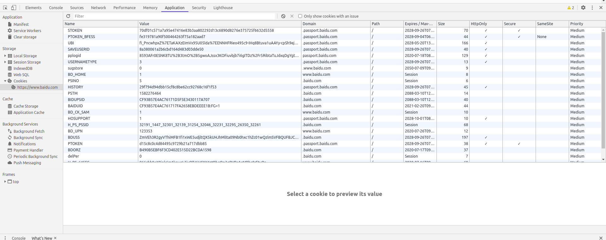

#会话（Session）和Cookies

## 静态网页和动态网页

## 无状态HTTP

HTTP的无状态是指HTTP协议对事物处理是没有记忆能力的，也就是说服务器不知道客户端是什么状态。
当我们向服务器发送请求后，服务器解析此请求，然或返回对应的响应，服务器负责完成这个过程，
而且这个过程是完全独立的，服务器不会记录前后状态的变化，也就是缺少状态记录。
这意味着如果后续需要处理前面的信息，则必须重传。

这是两个用于保持HTTP连接状态的技术就出现了：
- 会话Session
- Cookies

会话Session在服务端，也就是网站的服务器，用来保存用户的会话信息

Cookies在客户端，也可以理解为浏览器端，
有了Cookies, 浏览器在下次访问网页时会自动附带上它发送给服务器
服务器通过识别Cookies并鉴定出是哪个用户，然后再判断用户是否是登录状态，然后返回对应的响应。

我们可以理解为Cookies里面保存了登录的凭证，有了它，只需要在下次请求携带Cookies发送请求
而不必重新输入用户名、密码等信息重新登录了。

因此在爬虫中，有时候处理需要登录才能访问的页面时，我们一般会直接将登录成功后获取的
cookies放在请求头里面直接请求，而不必重新模拟登录。

##会话

会话，其本来的含义是指有时有终的一系列动作/消息。
比如，打电话时，从拿起电话拨号到挂断电话这中间的一系列过程可以称为一个会话。

而在web中，会话对象用来存储特定用户会话所需的属性及配置信息。
这样，当用户在应用程序的Web页之间跳转时，存储在会话对象中的变量将不会丢失，
而是在正整个用户会话中一直存在下去。当用户请求来自应用程序的Web页时，
如果该用户还没有会话，则web服务器将自动创建一个会话对象。
当会话过期或被放弃后，服务器将终止该会话。

##Cookies

Cookies指某些网站wier辨别用户身份、进行会话跟踪而存储在用户本地终端上的数据。

### 会话维持

当客户端第一次请求服务器时，服务器会返回一个请求头中有Set-Cookie字段的响应的响应给客户端，
用来标记是哪一个用户，客户端浏览器会把Cookies保存起来。
当浏览器下一次再请求网站时，浏览器会把此Cookies放到请求头一起提交给服务器，
Cookies携带了会话ID信息，服务器检查该Cookies即可找到对应的会话是什么，
然后再判断会话来以此辨认用户状态。

Cookies和会话需要配合，一个处于客户端，一个处于服务端，二者共同协作，就实现了登录会话控制。

### 属性结构

每个条目可以称为Cookie。

- Name: 该Cookie的名称。一旦创建，该名称便不可更改。
- Value: 该Cookie的值。如果是Unicode字符，需要为字符编码。
如果值为二进制数据，则需要使用BASE64编码。
- Domain: 可以访问该Cookie的域名。
例如，如果设置为.baidu.com，则所有以baidu.com结尾的域名都可以访问该Cookie。
- Max Age: 该Cookie失效的时间，单位为秒，也常和Expires一起使用，通
过它可以计算出其有效时间。Max Age如果为正数，则该Cookie在Max Age秒之后失效。
如果为负数，则关闭浏览器即失效，浏览器也不会以任何形式保存该Cookie。
- Path: 该Cookie的使用路径。如果设置为/path/,则只有路径为/path/的页面可以访问该Cookie。
如果设置为/，则本域名名下的所有页面都可以访问该Cookie.
- Size字段： 此Cookie的大小。
- HTTP字段：Cookie的httponly属性。若此属性为true,则只有在HTTP头中会带有此Cookie的信息，
而不能通过document.cookie来访问次Cookie.
- Secure: 该Cookie是否仅被使用安全协议传输。
安全协议有HTTPS和SSL等，在网络上传输数据之前先将数据加密。默认未false。

### 会话Cookie和持久Cookie

从表面意思来说
- 会话Cookie就是吧Cookie放在浏览器内存里，浏览器在关闭之后该Cookie即失效。
- 持久Cookie则会保存到客户端的硬盘中哦，下次还可以继续使用，用于长久保持登录状态。

其实严格来说，没有会话Cookie和持久Cookie之分，
只是由Cookie的Max Age或Expires字段决定了过期的时间。

因此一些持久化登录的网站其实就是把Cookie的有效时间和会话有效期设置得比较长。

## 常见误区

“只要关闭浏览器，会话就消失了”

除非程序通知服务器删除一个会话，否则服务器会一直保留。

但是当哦我们关闭浏览器时，浏览器不会主动关闭之前通知服务器它将关闭，所以服务器根本不会有机会知道浏览器已经关闭。

之所以会有这种错觉，是因为大部分会话机制都使用会话Cookie来保存会话ID信息，而关闭浏览器后Cookie就消失了，
再次连接服务器时，也就无法找到原来的会话了。如果服务器设置的Cookies保存到硬盘上，
或者使用某种手段改写浏览器发出的HTTP请求头，把原来的Cookie发送给服务器，则再次打开浏览器，仍然能够找到原来的
会话ID，依旧还是可以保持登录状态的。

而且恰恰是由于关闭浏览器不会导致会话被删除，这就需要服务器为会话设置一个失效时间，
当距离客户端上一次使用会话的时间超过这个失效时间时，服务器就可以认为客户端已经停止了活动，
才会把会话删除以节省存储空间。

